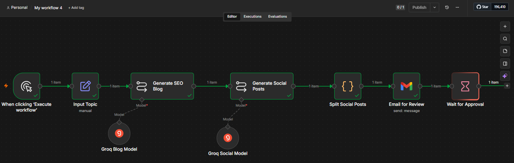
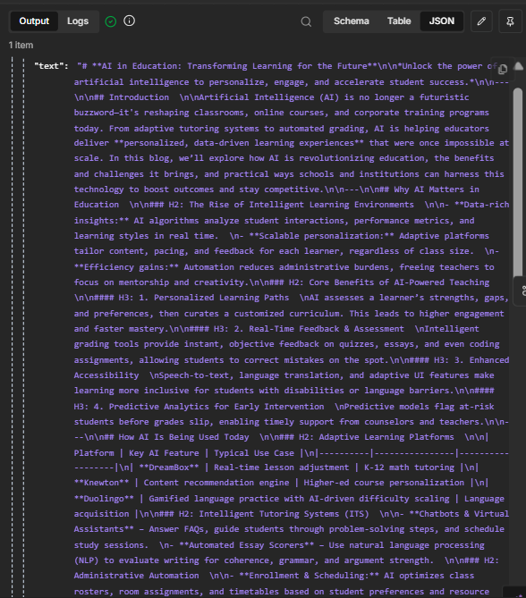
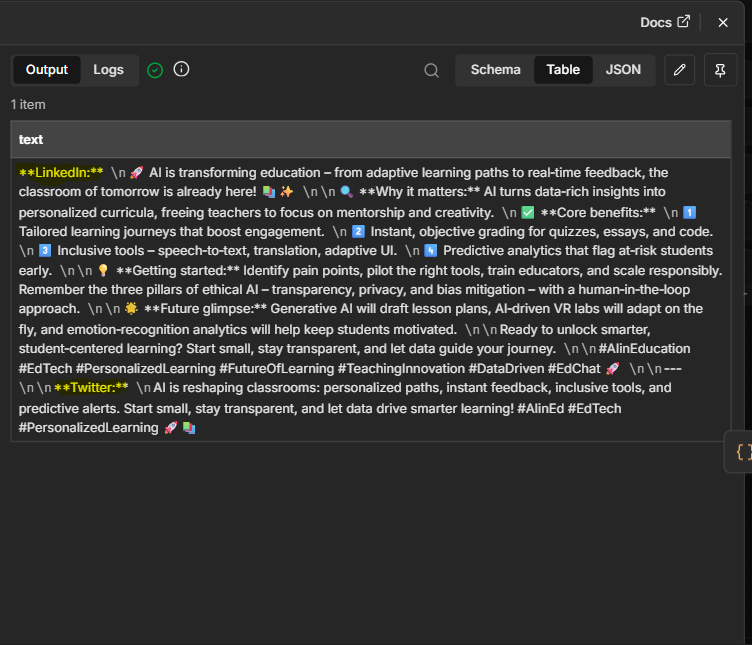
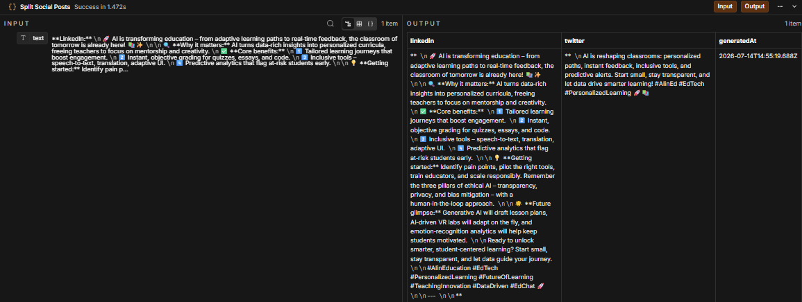
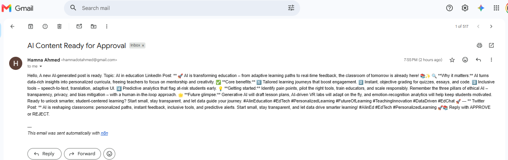

# 🤖 AI Content & Social Media Automation

An AI-powered content automation workflow built using **n8n** and **Groq AI**. This workflow generates an SEO-optimized blog, creates LinkedIn and Twitter/X posts, processes the generated content, and sends it via Gmail for human review before publishing.

---

## 📌 Overview

This project demonstrates how AI and workflow automation can streamline content creation.

The workflow accepts a topic as input, generates a complete blog article using Groq AI, creates platform-specific social media posts, extracts them into structured fields, and emails the content for manual review.

This project showcases practical AI automation using Large Language Models (LLMs) without requiring paid AI services.

---

## ✨ Features

- 📝 AI-powered SEO blog generation
- 💼 Automatic LinkedIn post creation
- 🐦 Automatic Twitter/X post creation
- 🔄 Structured content processing using JavaScript
- 📧 Email notification for human review
- ⚡ Workflow automation with n8n
- 🤖 Free AI integration using Groq

---

# 🛠 Technologies Used

- **n8n**
- **Groq API**
- **Groq Compound Mini Model**
- **JavaScript**
- **Gmail API**

---

# 📊 Workflow Architecture

```text
Manual Trigger
      │
      ▼
Input Topic
      │
      ▼
Generate SEO Blog
      │
      ▼
Generate Social Posts
      │
      ▼
Split Social Posts
      │
      ▼
Email for Review
      │
      ▼
Wait for Approval
```

---

# ⚙️ Workflow Explanation

## 1️⃣ Manual Trigger

The workflow starts manually by clicking **Execute Workflow** in n8n.

---

## 2️⃣ Input Topic

The user provides:

- Topic
- Blog Length
- Writing Tone

Example:

```text
Topic: AI in Education
Blog Length: 1200 Words
Tone: Professional
```

---

## 3️⃣ Generate SEO Blog

The first Groq language model receives the topic and generates a complete SEO-friendly blog.

The generated blog includes:

- Catchy Title
- Introduction
- H2 Headings
- H3 Headings
- Bullet Points
- FAQs
- Conclusion

---

## 4️⃣ Generate Social Posts

The generated blog is passed to another Groq language model.

This model creates:

- LinkedIn Post (Professional, Emoji Friendly)
- Twitter/X Post (Under 280 Characters)

---

## 5️⃣ Split Social Posts

A JavaScript Code node processes the AI response.

It extracts:

- LinkedIn content
- Twitter content

and converts them into structured JSON.

Example:

```json
{
  "linkedin": "...",
  "twitter": "...",
  "generatedAt": "2026-07-14T12:00:00Z"
}
```

---

## 6️⃣ Email for Review

The generated content is automatically sent through Gmail.

The email contains:

- Topic
- LinkedIn Post
- Twitter/X Post

This allows a human reviewer to check the content before publishing.

---

## 7️⃣ Wait for Approval

The workflow pauses after sending the email.

This represents a **Human-in-the-Loop** approval stage.

In a production environment, this node can be connected to:

- Telegram Bot
- Approval Form
- Webhook
- Company Review System

before automatically publishing the content.

---

# 📷 ScreenShots

## Workflow



---

## Generated Blog



---

## Generated Social Posts



---

## Structured Output



---

## Email Review



---

# 📁 Repository Structure

```text
AI-Content-Social-Automation/
│
├── ai-content-automation.json
├── README.md
├── screenshots/
│   ├── workflow.png
│   ├── blog-output.png
│   ├── social-output.png
│   ├── code-output.png
│   └── email-review.png
└
```


# 🎯 Learning Outcomes

This project helped me learn:

- AI Workflow Automation
- Prompt Engineering
- Groq LLM Integration
- n8n Workflow Development
- JavaScript Data Processing
- Email Automation
- Human-in-the-Loop Workflow Design

---

# 👩‍💻 Author

**Hamna Ahmed**

Bioinformatics Student | AI Automation Enthusiast | n8n Workflow Builder

---

## ⭐ If you found this project useful, consider giving it a star!
